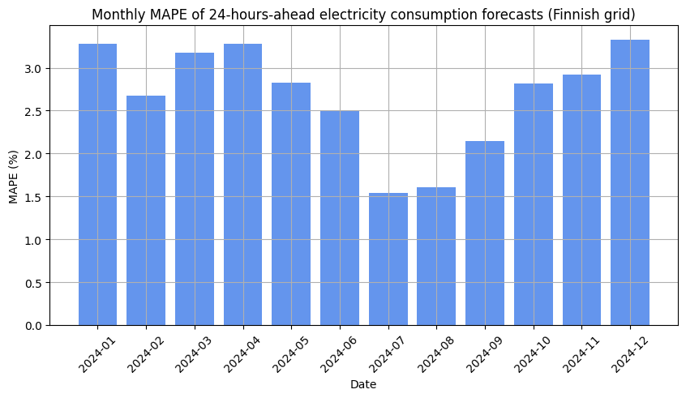

# Benchmarking TimesFM on electricity consumption data

TimesFM is a pre-trained univariate time-series forecasting model published in early 2024 [1]. Put simply, this model is capable of forecasting a sequence of data that is ordered in time (like hourly temperature or monthly flu cases) without any additional information or training. In the model's paper [2], the authors report that TimesFM was able to outperform both classical and deep learning models on well-known time-series datasets.

The goal of this project is to test TimesFM's accuracy on electricity consumption data on the Finnish transmission grid. Specifically, I am benchmarking the model on hourly consumption data from Jan 2024 to Dec 2024 by forecasting up to 24 hours ahead using the `timesfm` Python package [3]. The data was obtained from the operator of the Finnish grid through their Open Data portal [4].

# Results

> [!IMPORTANT]
> For a detailed write-up of the results, feel free to read the accompanying [blog post on my personal webpage](https://rnd195.github.io/posts/tfm-electricity-consumption/).
>
> If you'd be interested in the code, please take a look at `notebook.ipynb` in this repository.

For a quick review of the results, below is a summary of the forecasting scheme and a barplot of monthly mean absolute percentage error (MAPE) values comparing the actual electricity consumption vs the model's forecasts:

*Data*

- electricity consumption in Finland in MWh
- hourly frequency (resampled from 15-min by averaging)
- start 2024-01-01 00:00, end 2024-12-31 23:00 (excluding some missing values)

*Forecasting scheme*

- up to 24 hours ahead
- start at 00:00, generate predictions up to 23:00 each day, and move to the next day

*Model*
- TimesFM 200M with default parameters

# License

The code-related part (`notebook.ipynb`) of this repository is [MIT-licensed](https://github.com/rnd195/tfm-electricity-consumption/blob/main/LICENSE). The electricity consumption data is licensed under CC BY 4.0, see [4].

# References

[1] https://research.google/blog/a-decoder-only-foundation-model-for-time-series-forecasting/

[2] https://arxiv.org/abs/2310.10688

[3] https://github.com/google-research/timesfm

[4] ["Electricity consumption in Finland"](https://data.fingrid.fi/en/datasets/124) by [Fingrid](https://data.fingrid.fi/en) is licensed under [CC BY 4.0](https://creativecommons.org/licenses/by/4.0/)

